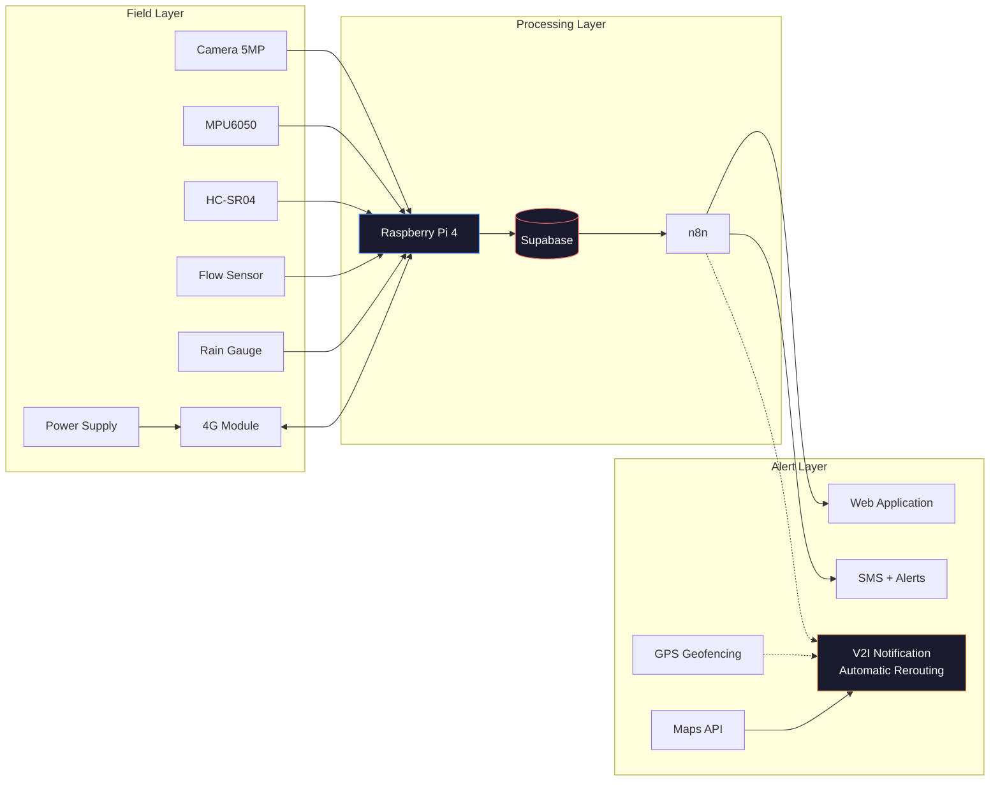

# BridgeGuard
**Intelligent urban flood risk prevention system using computer vision and edge computing**

BridgeGuard monitors water levels under bridges in real time, predicts flood risk using computer vision models, and automatically triggers alerts before a flood becomes critical.

---

## The problem

In Morocco, as in many other regions, flash floods regularly damage bridges and cut off vital roads often without alerts fast or localized enough. BridgeGuard addresses a simple question: **how can a bridge be monitored continuously, without human intervention, and warn people before it's too late?**

## System architecture

## How it works

1. **Acquisition**  a camera and 4 physical sensors (water level, vibration, flow rate, rainfall) continuously collect data on the bridge.
2. **AI analysis**  a semantic segmentation model (YOLOv8n-seg) identifies and quantifies water surfaces in the image, combined with OpenCV analysis (color-based segmentation + current speed via optical flow).
3. **Decision**  a threshold-based engine aggregates these signals into a risk score (low / moderate / critical).
4. **Active safety**  if the risk becomes critical, a second model (YOLOv8n) verifies the bridge is clear of vehicles before automatically triggering a physical barrier closure.
5. **Alert**  authorized engineers receive an SMS/email in under 5 seconds; a public dashboard informs residents of the bridge's status in real time.

## Results

| Metric | Result |
|---|---|
| Vehicle detection (YOLOv8n) | mAP50 = 0.926 |
| Water level precision (HC-SR04) | ± 0.3 cm |
| Alert response time | < 5 seconds |
| Segmentation inference speed | 12.5 ms/image |

## Tech stack

- **Edge**: Raspberry Pi 4, Python
- **Computer vision**: YOLOv8n-seg, YOLOv8n, OpenCV
- **Cloud**: Supabase (PostgreSQL + Realtime), n8n
- **Web**: React + TypeScript, Node.js + Express
- **Mechanical design**: CATIA (IP67 polycarbonate enclosure)
- **Power**: solar panel + MPPT + LiPo battery

The MPPT controller optimizes solar charging efficiency (+30% vs a standard PWM controller), while the buck regulator ensures a stable 5V/3A output — protecting the Raspberry Pi and sensors from battery voltage fluctuations. Total system consumption averages ~7W, giving roughly 24h of autonomy without sunlight.
