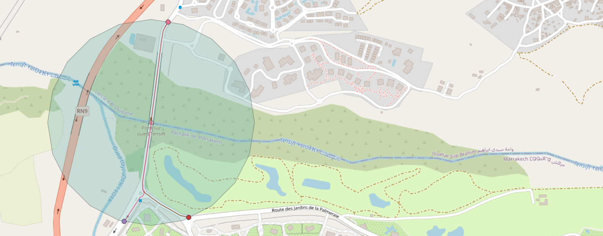
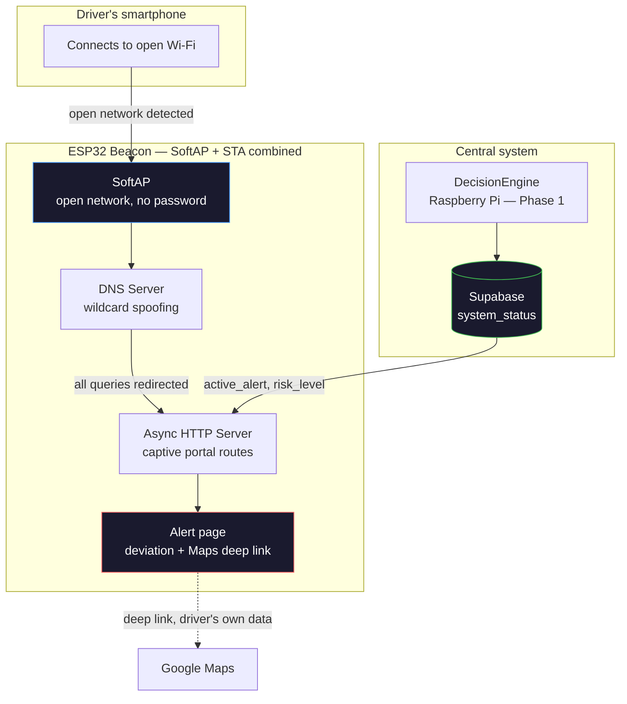
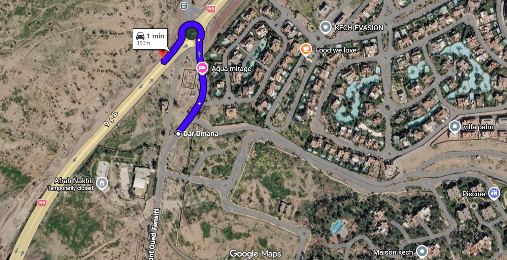
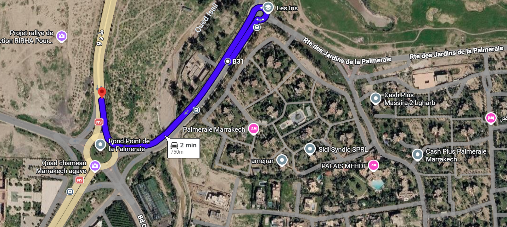
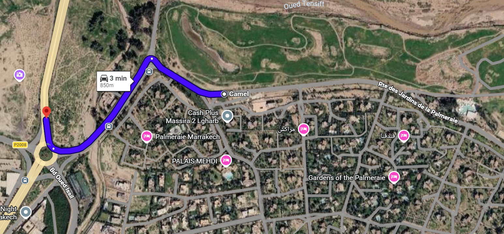
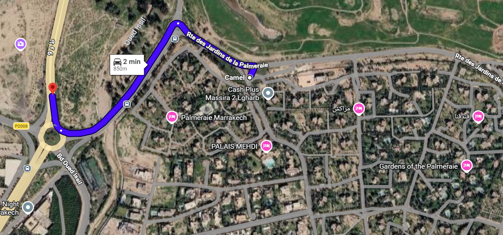
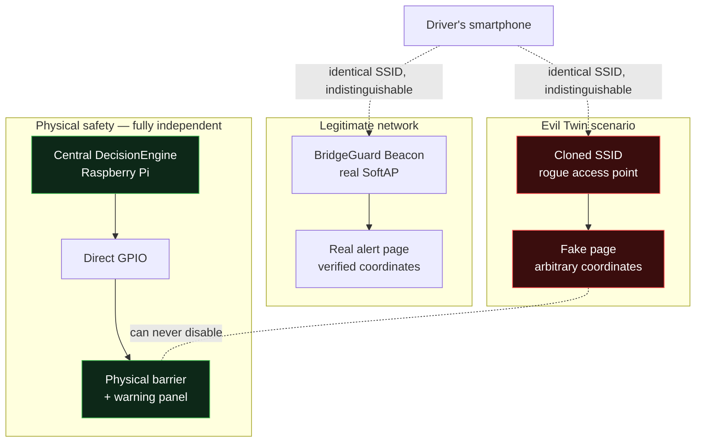

# BridgeGuard-Beacon

**Anonymous flood-alert notification via Wi-Fi captive portal, with an independent physical failsafe**

Second phase of BridgeGuard, extending a bridge flood-monitoring system with a Vehicle-to-Infrastructure (V2I) notification channel that reaches any smartphone, with zero app install and zero prerequisite.

---

## The problem

BridgeGuard (Phase 1) detects flood risk and closes a physical barrier automatically — but the driver approaching the bridge has no way of knowing *why* traffic is stopped, or where to go instead. Most vehicles have no native V2X connectivity, so any notification channel has to work with a standard smartphone, out of the box, without depending on installed apps.

## Why 500 m, why 3 axes

The geofencing radius isn't arbitrary — it comes directly from the physics of the approach:

- Speed limit at the bridge: **60 km/h → 16.67 m/s**
- Required advance warning window: **30 s** (reaction + comprehension + maneuver time)
- → **d = 16.67 × 30 ≈ 500 m**

Three vehicle access axes converge on the bridge (North, South-West via Bd Oued Issil, South-East via Palmeraie — two entry roads). Each was mapped and validated in QGIS to confirm beacon placement sits within the 500 m radius while accounting for real road topology.



## Architecture



## How it works

1. **Detection** — the ESP32 broadcasts an open Wi-Fi network (`BridgeGuard-Alerte`) near each bridge access axis. No password, no app — the phone's own OS (iOS Captive Network Assistant, Android Connectivity Check) is the only client needed.
2. **Redirection** — a lightweight DNS server resolves every domain query to the beacon's own IP, and an async HTTP server intercepts OS-specific captive-portal probes (`/generate_204`, `/hotspot-detect.html`) to serve the alert page automatically.
3. **Guidance** — the page opens a deep link straight into the driver's own Maps app, from a hardcoded beacon-position origin to a pre-verified safe point — no live routing computed on-device, no dependency on the driver's GPS fix.
4. **Sync with the central system** — running in combined `WIFI_AP_STA` mode, the same ESP32 polls a read-only Supabase endpoint every 10 s to read the already-computed `active_alert` flag from the central DecisionEngine (Phase 1) — no risk logic duplicated on the beacon.
5. **Physical failsafe** — a dedicated GPIO on the central Raspberry Pi drives an upstream warning panel, triggered in the same call as the barrier closure — independent of Wi-Fi, smartphones, or any voluntary technology adoption.

## Pre-calculated deviation routes

The beacon never computes a route on-device — it only knows two fixed points per axis: its own position, and a verified nearby point that is outside the risk zone. Guidance itself is entirely delegated to the driver's own Maps app.

| Axe | Balise (origine) | Point sûr (destination) | Distance | Itinerary |
|---|---|---|---|---|
| A — Nord | 31.695430, -7.987536 | 31.696762, -7.987861 | ≈ 150 m |  |
| B — Sud-Ouest (Oued Issil) | 31.688102, -7.989490 | 31.687348, -7.992351 | ≈ 285 m |  |
| C — Sud-Est (entrée 1) | 31.688106, -7.986236 | 31.687348, -7.992351 | ≈ 585 m |  |
| C — Sud-Est (entrée 2) | 31.687806, -7.986669 | 31.687348, -7.992351 | ≈ 541 m |  |

Each destination was empirically validated against Google Maps' actual routing engine — not just estimated visually on a satellite image — since real road topology (one-way segments, roundabout connectivity) can silently reroute a seemingly short path into a much longer one.

## Multi-point deployment & corridor coverage

A single beacon covers roughly 1.8–3 s of radio exposure at 60 km/h (30–50 m theoretical Wi-Fi range). A missed contact — locked screen, undetected notification — means the entire 30 s advance warning is lost.

Deploying **3 beacons per axis** turns this into a corridor:

- Beacon spacing: 500 m ÷ 3 ≈ **167 m**
- Latency window per missed contact: 167 m ÷ 16.67 m/s ≈ **10 s** (down from 30 s)

All beacons share the same SSID, so a phone that already joined one reconnects automatically to the next — turning Android's inconsistent auto-notification (see Results) into a non-issue on the second and third contact.

This is a probabilistic improvement, not a guarantee — which is exactly why the physical failsafe (below) exists as the only non-conditional safety layer.

## Field range validation protocol

Documented (not yet executed) protocol to replace the 30–50 m theoretical Wi-Fi range with real measured coverage:

1. Move away from the beacon in 10 m increments along the road axis.
2. At each point, record: SSID visibility, RSSI (dBm), whether the alert page actually loads, and GPS coordinates.
3. Repeat in both approach directions (range isn't necessarily symmetric).
4. Map results in QGIS, overlaid on the theoretical 500 m geofencing radius.

The distinction between *SSID visible* and *page actually loads* matters — a network can stay visible past the point where throughput still allows loading the full page in time.

## Security posture — the Evil Twin threat

An open, unauthenticated network is a deliberate trade-off: it's the only way to trigger a native captive portal without any app. But it also means the channel is structurally spoofable — anyone can broadcast the same SSID and serve a fake page.



**This is treated as an accepted, structural limitation — not a gap to patch over.** No client-side signature or watermark can protect against an attacker who simply clones the page, since the verification mechanism would be cloned along with it. Two things actually limit the real-world impact:

1. **The physical failsafe never depends on the beacon.** Barrier closure is triggered directly by the central DecisionEngine via GPIO — a compromised beacon can misinform about a detour, but can never disable the real safety mechanism.
2. **The beacon is deliberately positioned as informational, not authoritative.** Any reroute decision requiring real trust belongs to an authenticated channel — this is precisely the role of the upcoming BridgeGuard-OBU (Phase 3).

## Physical failsafe

A GPIO-driven upstream warning panel (LED array, amber/red blinking) is installed before each safe-detour divergence point, triggered in the *same* function call as the barrier closure — never sequential, never software-dependent beyond a single binary GPIO state. No wireless interface, no exposed API, nothing to spoof.

This reflects the project's core safety principle: **physical safety must never depend on an action or device the user might not have.**

## Validated results

| Test | Result |
|---|---|
| Captive portal — iOS | Automatic popup, immediate |
| Captive portal — Android (Samsung One UI) | No auto-notification; page reachable via manual network access |
| Supabase read (`system_status`) | Live JSON confirmed (`risk_level`, `active_alert`, `bridge_state`) |
| Combined SoftAP + STA mode | Both interfaces stable simultaneously |
| Pre-calculated deviation routes | 4 real routes verified on Google Maps (3 axes) |

The Android limitation is a documented, known constraint of OS-level captive-portal detection — not a flaw in the DNS/HTTP layer, confirmed working via manual access.

## Tech stack

- **Hardware**: ESP32 (NODE32S), PlatformIO / Arduino framework
- **Captive portal**: `WiFi.h` (SoftAP), `DNSServer`, `ESPAsyncWebServer`
- **Central sync**: `HTTPClient` → Supabase REST API (read-only, RLS-restricted key)
- **Guidance**: Google Maps universal deep link (no embedded routing engine)
- **Site analysis**: QGIS (beacon placement within the 500 m geofencing radius)

## Folder structure
```
beacon/
├── src/main.cpp          → SoftAP, DNS, HTTP server, Supabase client
├── include/
│   └── secrets.h.example → credential template
├── gis/                  → QGIS project + route/placement
├── platformio.ini
```
